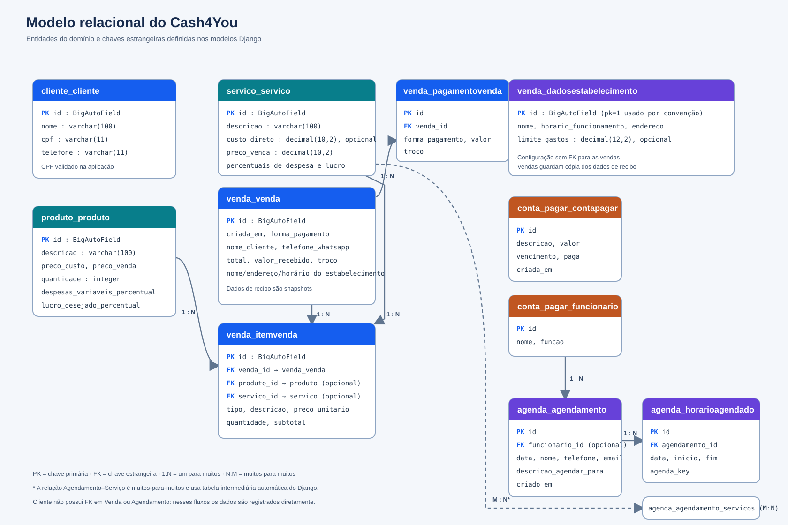

# Documentação do banco de dados

## Visão geral

O Cash4You usa Django ORM e, na configuração atual, SQLite no arquivo `db.sqlite3`. O esquema físico é criado e evoluído por migrations. Os nomes apresentados neste documento seguem os modelos Django; o nome físico pode variar se `db_table` for configurado no futuro.

O diagrama abaixo apresenta as entidades de domínio, suas chaves e os relacionamentos declarados no código:

## Entidades e atributos

`id` é uma chave primária `BigAutoField` implícita em todos os modelos, salvo configuração diferente do projeto.

| Entidade | Atributos principais | Descrição |
|---|---|---|
| `cliente.Cliente` | `nome` (100), `cpf` (11), `telefone` (11) | Cadastro de clientes. O método `clean()` remove espaços externos e valida nome, CPF numérico com 11 dígitos e telefone numérico. `save()` executa `full_clean()`. |
| `produto.Produto` | `descricao` (100), `preco_custo` (10,2), `preco_venda` (10,2), `quantidade` (inteiro), `despesas_variaveis_percentual` (5,2, opcional), `lucro_desejado_percentual` (5,2, opcional) | Catálogo de produtos e saldo de estoque. Percentuais têm validadores de 0 a 100. |
| `servico.Servico` | `descricao` (100), `custo_direto` (10,2, opcional), `preco_venda` (10,2), `despesas_variaveis_percentual` (5,2, opcional), `lucro_desejado_percentual` (5,2, opcional) | Catálogo de serviços e parâmetros de precificação. Custos não podem ser negativos; percentuais têm faixa de 0 a 100. |
| `venda.Venda` | `criada_em`, `forma_pagamento`, `nome_cliente`, `telefone_whatsapp`, `total`, `valor_recebido`, `troco`, `nome_estabelecimento`, `horario_funcionamento`, `endereco_estabelecimento` | Cabeçalho da venda. Forma de pagamento aceita dinheiro, crédito, débito ou Pix. Nome, telefone e dados do estabelecimento são registrados como valores da própria venda, sem FK para outros cadastros. |
| `venda.ItemVenda` | `venda_id`, `tipo`, `produto_id` (opcional), `servico_id` (opcional), `descricao`, `preco_unitario`, `quantidade`, `subtotal` | Linha histórica de uma venda. Mantém descrição e preços da ocasião; quantidade deve ser pelo menos 1. `tipo` distingue produto e serviço. |
| `venda.PagamentoVenda` | `venda_id`, `forma_pagamento`, `valor`, `troco` | Parcela de pagamento associada a uma venda; possibilita detalhar pagamentos múltiplos. |
| `venda.DadosEstabelecimento` | `nome`, `horario_funcionamento`, `endereco`, `limite_gastos` (12,2, opcional) | Configuração do estabelecimento. A tela usa o registro `pk=1` por convenção. O teto aceita valor não negativo ou nulo. Não há restrição de singleton no banco. |
| `conta_pagar.ContaPagar` | `descricao` (160), `valor` (12,2), `vencimento`, `paga`, `criada_em` | Registro de um gasto, seu vencimento e situação de pagamento. Valor não pode ser negativo. |
| `conta_pagar.Funcionario` | `nome` (160), `funcao` (120) | Cadastro de responsáveis que podem ser associados a agendamentos. |
| `agenda.Agendamento` | `data`, `nome`, `telefone`, `email`, `funcionario_id` (opcional), `descricao_agendar_para`, `criado_em`, `servicos` | Compromisso de um cliente identificado por campos próprios. Pode apontar para um funcionário e relacionar um ou mais serviços. |
| `agenda.HorarioAgendado` | `agendamento_id`, `data`, `inicio`, `fim`, `agenda_key` | Bloco de horário reservado para um agendamento e recurso/responsável. |
| `usuario.Usuario` | campos herdados de `AbstractUser`, `nome`, `email` | Usuário de autenticação customizado. O e-mail é único e é o identificador de login. As associações de grupos e permissões são fornecidas pelo Django. |

### Relações e exclusões

| Origem → destino | Cardinalidade | Comportamento ao excluir |
|---|---:|---|
| `Venda` → `ItemVenda` | 1:N | `CASCADE`: apagar a venda apaga suas linhas. |
| `Venda` → `PagamentoVenda` | 1:N | `CASCADE`: apagar a venda apaga seus pagamentos. |
| `Produto` → `ItemVenda` | 1:N opcional | `SET_NULL`: a linha histórica permanece se o produto for excluído. |
| `Servico` → `ItemVenda` | 1:N opcional | `SET_NULL`: a linha histórica permanece se o serviço for excluído. |
| `Agendamento` → `HorarioAgendado` | 1:N | `CASCADE`: horários são apagados junto ao agendamento. |
| `Funcionario` → `Agendamento` | 1:N opcional | `SET_NULL`: o agendamento permanece sem o funcionário. |
| `Agendamento` ↔ `Servico` | N:M | Tabela intermediária automática do Django; as associações são removidas ao excluir qualquer lado. |

## Regras e decisões de modelagem

- Valores monetários são armazenados como `DecimalField`, evitando ponto flutuante binário nos cálculos financeiros.
- A venda preserva descrição, preço unitário e subtotal dos itens no momento da operação. Os vínculos com produto ou serviço são opcionais para manter o histórico mesmo após exclusões do catálogo.
- Uma venda não tem FK para `Cliente`: no caixa, nome e telefone são informados e copiados para o registro. Agendamentos também guardam nome, telefone e e-mail sem FK para `Cliente`.
- `ItemVenda` possui FKs opcionais para produto e serviço e um campo `tipo`. O modelo não declara constraint de banco que obrigue exatamente um dos dois vínculos; essa consistência é conduzida pelo fluxo de venda.
- `DadosEstabelecimento` não tem relação direta com `Venda`. Nome, endereço e horário são copiados para cada venda para compor comprovantes históricos. `limite_gastos` é consultado no fluxo de gastos e não é copiado para as vendas.
- O limite de gastos é uma regra da aplicação, não uma constraint relacional: formulários e mudança de status verificam se o total pendente ultrapassa o teto.
- `HorarioAgendado` define uma constraint única em (`data`, `inicio`, `agenda_key`) e valida blocos de 30 minutos, início em hora cheia ou meia hora e faixa diária das 07:00 às 23:00.
- A aplicação exibe gastos como “Gastos a pagar”, mas os nomes de modelos e tabelas seguem os identificadores existentes (`ContaPagar` / `conta_pagar`).

## Django e tabelas auxiliares

Além das entidades de domínio, Django mantém tabelas de migrations, sessões, tipos de conteúdo, grupos e permissões (`django_migrations`, `django_session`, `django_content_type`, `auth_group`, `auth_permission` e tabelas de associação). O usuário do sistema é o modelo customizado `usuario.Usuario`; suas relações de autenticação seguem o mecanismo padrão do Django.

## Diagrama funcional relacionado

O esquema relacional descreve onde os dados são armazenados. Para ver como as telas e módulos trocam dados durante o uso, consulte [Funcionalidades e fluxos do sistema](Funcionalidades_e_Fluxos.md) e o [mapa visual de funcionalidades](Mapa_Funcionalidades.svg).
