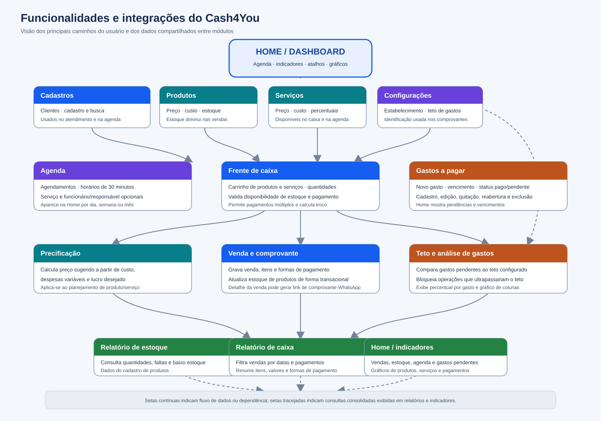

# Funcionalidades e fluxos do sistema

## Mapa visual

O diagrama resume as funcionalidades principais do Cash4You e mostra onde os dados de cada módulo são reutilizados.

## Funcionalidades

### Home e dashboard

A Home reúne calendário e indicadores. O calendário pode ser consultado por dia, semana ou mês e apresenta agendamentos e vencimentos de gastos. Os indicadores mostram vendas e faturamento do dia, clientes cadastrados, produtos com estoque baixo, gastos pendentes e gastos pagos. Gráficos complementares resumem produtos e serviços mais vendidos, formas de pagamento, situação de estoque e valores de venda ao longo do período selecionado. Os cards e eventos abrem as respectivas áreas para consulta.

### Cadastros de apoio

- **Clientes:** inclusão, busca, edição e exclusão. CPF é validado; telefone e nome são verificados antes de salvar. Os dados de cliente não são ligados por chave estrangeira às vendas ou aos agendamentos.
- **Produtos:** cadastro de descrição, custo, preço de venda, quantidade e percentuais de despesas variáveis e lucro desejado. O saldo alimenta o caixa, a Home e o relatório de estoque.
- **Serviços:** cadastro de descrição, custo direto, preço e percentuais. O catálogo é usado na frente de caixa e pode ser associado a agendamentos.
- **Funcionários:** cadastro de nome e função. Um funcionário pode ser selecionado como responsável por agendamentos.

### Precificação

A área de precificação calcula preço sugerido para produto ou serviço a partir do custo, das despesas variáveis e do lucro desejado. O cálculo é uma ferramenta de planejamento; os dados de precificação são cadastrados nos produtos e serviços e não criam, por si só, uma venda.

### Agenda

O usuário cria, consulta, edita e exclui agendamentos com nome, telefone, e-mail, data, serviço e responsável opcionais. Os horários são organizados em blocos de 30 minutos, com validações de horário e conflito para a mesma agenda/responsável. Os registros alimentam o calendário da Home. As informações de contato do agendamento são próprias e não dependem do cadastro de clientes.

### Frente de caixa, venda e comprovante

1. O caixa consulta os catálogos de produtos e serviços e monta um carrinho de sessão.
2. Adicionar ou alterar a quantidade de produto confere o saldo disponível; serviço não movimenta estoque.
3. Na finalização, o sistema valida o total e o pagamento, incluindo combinações de formas de pagamento e cálculo de troco quando aplicável.
4. Em uma transação de banco, grava o cabeçalho da venda, as parcelas de pagamento e as linhas históricas. Para produtos, desconta a quantidade do estoque; se não houver saldo suficiente, a venda inteira é cancelada.
5. O detalhe da venda exibe os itens e pagamentos. Quando há telefone informado, disponibiliza a mensagem pré-preenchida do comprovante no WhatsApp, incluindo dados de estabelecimento que foram copiados para a venda.

O histórico pode ser filtrado por intervalo de datas e forma de pagamento. Uma venda pode ser editada ou excluída; ao editar ou excluir, as quantidades de produtos são ajustadas para manter o estoque coerente.

### Dados do estabelecimento e gastos a pagar

Em **Configurações > Dados do estabelecimento**, o usuário mantém nome, endereço e horário de funcionamento para os comprovantes e define, opcionalmente, a margem máxima de gastos.

A tela **Gastos a pagar** permite cadastrar, editar, pagar/reabrir e excluir gastos. O teto configurado limita a soma dos gastos pendentes. O formulário bloqueia cadastro ou edição que faça o total ultrapassar o teto. A reabertura de um gasto pago também verifica o limite. Contas pagas não entram no total pendente.

Cada gasto da listagem mostra `valor ÷ margem máxima × 100`, arredondado para duas casas. No final, um gráfico de colunas compara os percentuais individuais. A tabela contém gastos pagos e pendentes. Se a margem não estiver configurada, a mensagem informa **Configurações > Dados do estabelecimento** e leva diretamente à configuração. Sem limite positivo não há percentuais/gráfico.

### Relatórios

- **Caixa:** consulta vendas de uma data, detalha itens e totaliza formas de pagamento.
- **Estoque:** lista produtos, quantidades e situação (em falta, baixa ou adequada). É baseado no catálogo de produtos.

## Resumo das integrações

| Origem | Informação compartilhada | Destino |
|---|---|---|
| Produtos | Preço, descrição e disponibilidade | Frente de caixa, itens de venda, dashboard e relatório de estoque |
| Serviços | Descrição e preço | Frente de caixa, itens de venda, agenda e indicadores de vendas |
| Estoque | Saldo disponível e alterações por venda | Frente de caixa, Home e relatório de estoque |
| Venda | Data, total, itens e pagamentos | Histórico, comprovante, Home, gráficos e relatório de caixa |
| Dados do estabelecimento | Identificação e teto financeiro | Comprovante da venda e validação/análise de gastos |
| Gastos pendentes | Valor e vencimento | Teto financeiro, calendário da Home, indicadores e gráfico percentual |
| Funcionários | Nome do responsável | Agendamentos e calendário |
| Agendamentos | Data, horário e responsável | Calendário da Home |

## Navegação principal

| Área | Caminho |
|---|---|
| Home | `/` |
| Cadastros | `/cadastrar/` |
| Produtos | `/produto/` |
| Serviços | `/servico/` |
| Clientes | `/cliente/` |
| Agenda | `/agenda/` |
| Frente de caixa | `/vendas/` |
| Dados do estabelecimento | `/vendas/configuracoes/` |
| Histórico de vendas | `/vendas/historico/` |
| Gastos a pagar | `/contas-a-pagar/` |
| Precificação | `/configuracoes/precificacao/` |
| Relatório de caixa | `/relatorios/caixa/` |
| Relatório de estoque | `/relatorios/estoque/` |

Os caminhos acima descrevem as rotas Django declaradas no projeto. A rota de administração do Django é `/admin/`.
